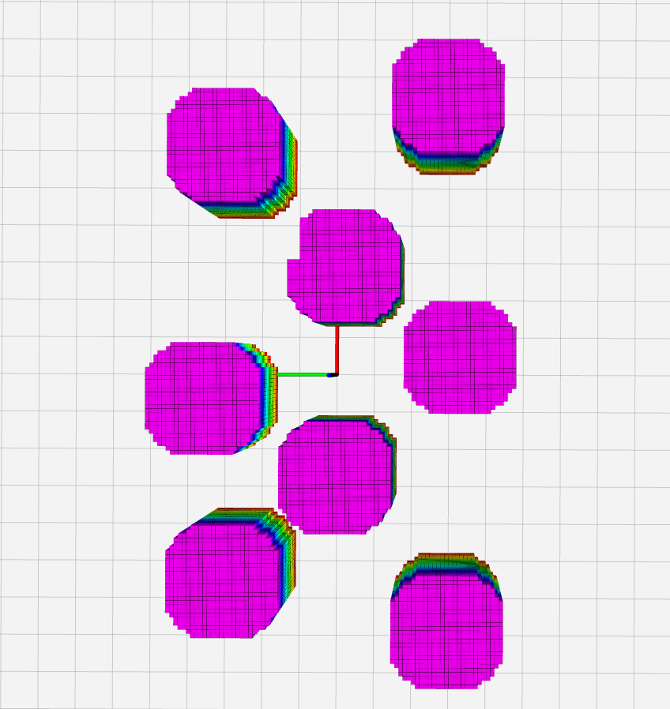
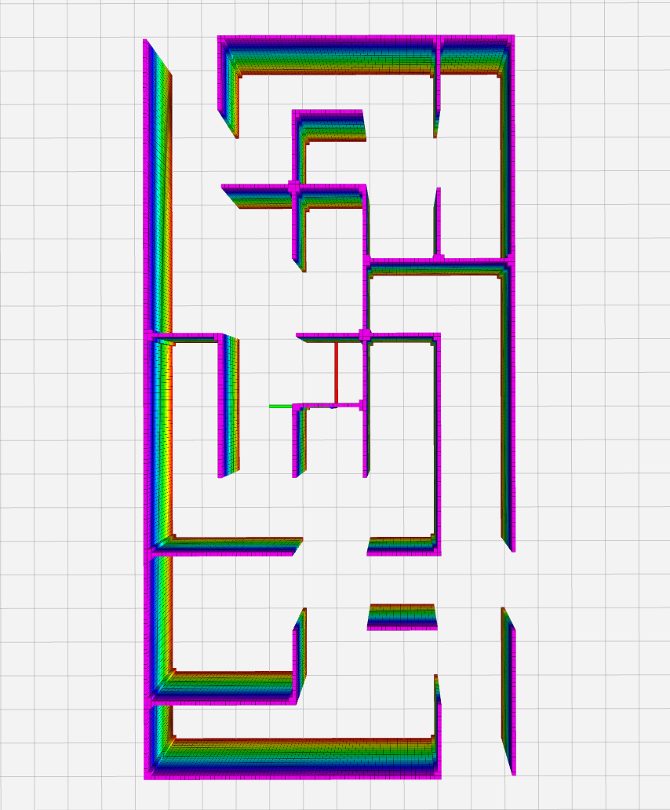

# Kumar Lab Parameterized Map


All in one! It's a revolution of map parameterization and representation for motion planning! Let's see.


## 0. Setup


### 0.1 general map annotation


<p align="center">
  
</p>


## 1. Usage


### 1.1 Grid Map Reader

It support file format as:

- image map: .png 
- rosbag: sensor_msgs::PointCloud
- rosbag: sensor_msgs::PointCloud2
- pcd


set the map mode and file path in "read_grid_map.launch" and launch 
```
roslaunch param_env read_grid_map.launch
```

The image map are converted into fake 3d.

<p align="center">
  
  
</p>

The pointcloud in bags is shown as:

<p align="center">
  
  
</p>


You can also set the inflation (m) to inflate the grid map

```
<param name="map/inflate_radius" value="0.3"/>
```

<p align="center">
  
  
</p>


The topics:

- /read_grid_map/global_cloud: publish the point clouds 
- /read_grid_map/global_gridmap: publish the center points of the grid map with inflation


### 1.2 Sctructed Map Generator


```
roslaunch param_env structure_map.launch
```

You can adjust the apprximate ratio of each element (overlapping is also counting now) in the launch file 

```
<param name="map/cylinder_ratio" value="0.10" type="double"/>
<param name="map/circle_ratio"   value="0.02" type="double"/>
<param name="map/gate_ratio"     value="0.02" type="double"/>
<param name="map/ellip_ratio"    value="0.02" type="double"/>
<param name="map/poly_ratio"     value="0.01" type="double"/>
```

Examples:

<p align="center">
  
  
  
  
</p>

By increasing the occupied ratios, it's harder to generate feasible trajectories

<p align="center">
  
  
  
</p>

You can also enable noise around the obstalce by setting:

```
  <param name="params/add_noise" value="true"/>
```


The topics:

- /structure_map/global_cloud: publish the point clouds 


### 1.3 Change resolution or change map


You can also change the resolution online by publishing the resolution value to:

```
/structure_map/change_res
```
or

```
/read_grid_map/change_res
```

<p align="center">
  
  
  
  
</p>


For read maps, you can publish all the maps by setting folder path in launch file

```
 <param name="folder_path" value="$(find param_env)/data/img/maze/"/>

```


Publish true in topic

```
/structure_map/change_map
```
or

```
/read_grid_map/change_map
```

to trigger the function.


### 1.4 Dataset generation 

If you want to save map, set "dataset/save_map" to true, and set the data number in "dataset/samples_num".

```
    <param name="dataset/save_map"    value="true"/>
    <param name="dataset/samples_num" value="100"/>
    <param name="dataset/start_index" value="5080900"/>
    <param name="dataset/path"        value="$(find param_env)/dataset/"/>

```

It will be saved into the path you set.